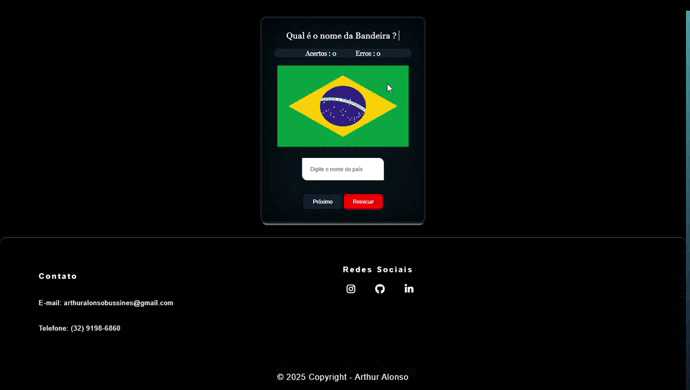
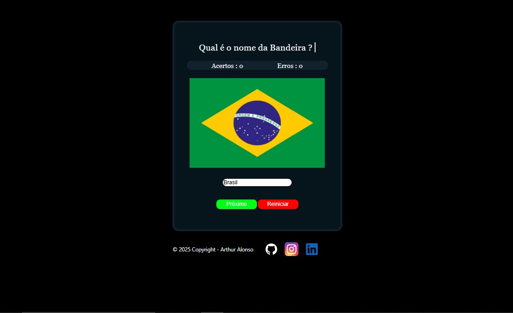
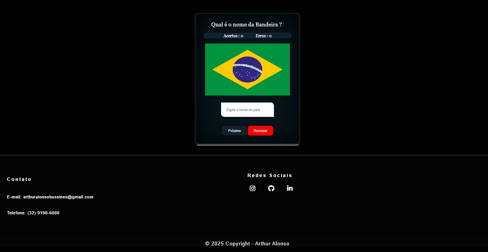

# 🏳️‍🌍 **Quiz de Bandeiras**

<p align="center">
  
  
  
  
</p>

---

## 🔗 **Acesso ao Projeto**

👉 **Versão Online:** 

👉 **Netlify:** *[quiz-de-bandeiras-react.netlify.app](https://quiz-de-bandeiras-react.netlify.app/)*

---
## 🎥 **Demonstração do Projeto (GIF)**

📌 GIF mostrando o fluxo principal do quiz.



## 📘 **Sobre o Projeto**

O **Quiz de Bandeiras** é um aplicativo web interativo criado em **React.js**, utilizando dados reais da **REST Countries API**.
Sua proposta é simples: testar os conhecimentos do usuário sobre bandeiras do mundo de forma leve, rápida e divertida.

O projeto foi construído com foco em:

* 🟦 Navegação intuitiva
* 🟦 Layout moderno e limpo
* 🟦 Responsividade aprimorada
* 🟦 Código organizado e componentizado
* 🟦 Evolução visual documentada via screenshots

---

## ✨ **Funcionalidades**

* ❓ Perguntas aleatórias de múltipla escolha
* 🏅 Contagem automática de acertos
* 🖼️ Exibição das bandeiras em alta qualidade
* 📱 Layout responsivo e otimizado
* 🔄 Alternativas embaralhadas
* 🌐 Consumo em tempo real da REST Countries API
* 📸 Histórico visual do desenvolvimento

---

## 📸 **Capturas de Tela**

### 🌱 Primeira Versão



### 🌿 Versão Atual



---

## 🛠️ **Tecnologias Utilizadas**

| Tecnologia             | Função                       |
| ---------------------- | ---------------------------- |
| **React.js**           | Estrutura e componentes      |
| **JavaScript ES6+**    | Lógica do quiz               |
| **CSS Responsivo**     | Estilização mobile e desktop |
| **REST Countries API** | Fonte dos dados dos países   |

---

## ⚙️ **Como Executar Localmente**

```bash
# Clone o repositório
git clone https://github.com/Alieinstein2008/Quiz-de-Bandeiras.git

# Entre na pasta
cd Quiz-de-Bandeiras

# Instale as dependências
npm install

# Inicie o projeto
npm start
```

Acesse no navegador: [http://localhost:3000](http://localhost:3000)

---

# 👥 **Créditos e Contribuições**

## 🧑‍🚀 Desenvolvedor Principal

### **Alieinstein2008**

Responsável por:

* Desenvolvimento completo da lógica do quiz
* Estruturação e arquitetura do projeto
* Consumo e tratamento da API
* Construção de componentes React
* Organização do layout e identidade do projeto
* Adição de funcionalidades principais
* Autoria da evolução visual do app

---

## 🤝 Contribuidor

### **Eduardo Maia**

Contribuiu de forma significativa para:

* 📱 *Otimização da responsividade mobile*
* 🔧 Ajustes e melhorias estruturais nos arquivos `.css`
* 🛠️ Melhoria na experiência em telas pequenas

Seu trabalho tornou o projeto mais acessível e funcional.

---

## 🗂️ **Estrutura do Projeto**

```
/Quiz-de-Bandeiras
│   README.md
│   package.json
│   ...
├── src/
│   ├── components/
│   ├── pages/
│   ├── api/
│   ├── assets/
│   └── App.js
└── visualizations/
    ├── screenshot-v1.png
    ├── screenshot-v2.png
    ├── demo.gif   
    
```

---

## 🚀 **Planos Futuros**

* ⏱️ Modo com temporizador
* 🧭 Quiz por continente
* 🌍 Suporte multilíngue (i18n)
* 🏆 Rankings e sistema de pontos
* 🧪 Testes automatizados
* 🔄 Deploy automatizado (CI/CD)

---

## 🤝 **Como Contribuir**

1. Faça um **fork**
2. Crie uma branch de recurso:
   `git checkout -b feature/novo-recurso`
3. Faça o commit das mudanças
4. Envie um **Pull Request**

Sugestões, ideias e correções são bem-vindas.

---

## 📄 **Licença**

Licenciado sob **MIT License**.

---
